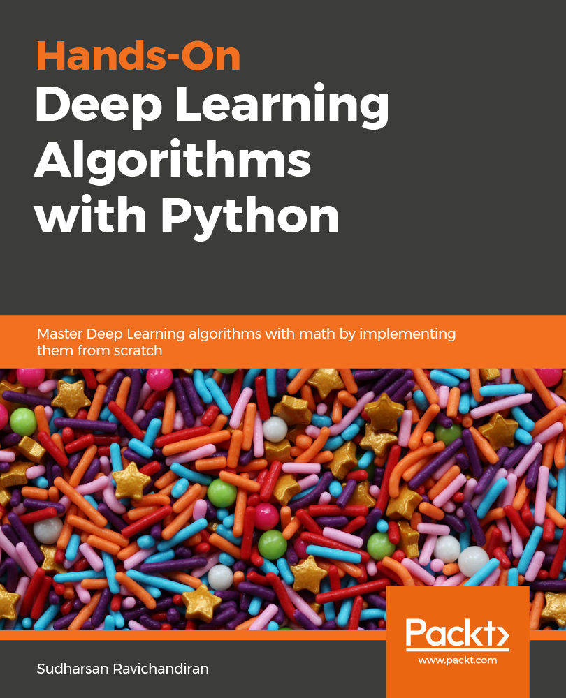

# [Hands-On Deep Learning Algorithms With Python](https://www.amazon.com/gp/product/B07LH43V8P?pf_rd_p=019ad97c-f176-43be-96b9-991a6dc65763&pf_rd_r=X02K63S0YE0Z2S67N8AF)

###  Master Deep Learning Algorithms with Extensive Math by Implementing them using TensorFlow

## About the book

Deep learning is one of the most popular domains in the artificial intelligence (AI) space, which allows you to develop multi-layered models of varying complexities. This book is designed to help you grasp things, from basic deep learning algorithms to the more advanced algorithms. The book is designed in a way that first you will understand the algorithm intuitively, once you have a basic understanding of the algorithms, then you will master the underlying math behind them effortlessly and then you will learn how to implement them using TensorFlow step by step.

The book covers almost all the state of the art deep learning algorithms. First, you will get a good understanding of the fundamentals of neural networks and several variants of gradient descent algorithms. Later, you will explore RNN, Bidirectional RNN, LSTM, GRU, seq2seq, CNN, capsule nets and more. Then, you will master GAN and various types of GANs and several different autoencoders. 

By the end of this book, you will be equipped with the skills you need to implement deep learning in your projects.

## Get the book 

  

<a target="_blank" href="https://books.google.co.in/books?id=8DqlDwAAQBAJ&source=gbs_book_other_versions">
  

 

 

#### For for updates follow me on Twitter ([@sudharsan13296](https://twitter.com/sudharsan13296)) and on LinkedIn ([Sudharsan Ravichandiran](https://www.linkedin.com/in/sudharsan1396/))

## Table of contents 

### [1. Introduction to Deep Learning](https://github.com/sudharsan13296/Hands-On-Deep-Learning-Algorithms-with-Python/tree/master/01.%20Introduction%20to%20Deep%20Learning)

* [1.1. What is Deep Learning?](https://github.com/sudharsan13296/Hands-On-Deep-Learning-Algorithms-with-Python/blob/master/01.%20Introduction%20to%20Deep%20Learning/1.01%20What%20is%20Deep%20Learning%3F.ipynb)
* [1.2. Biological and Artifical Neurons](https://github.com/sudharsan13296/Hands-On-Deep-Learning-Algorithms-with-Python/blob/master/01.%20Introduction%20to%20Deep%20Learning/1.02%20Biological%20and%20Artificial%20Neurons.ipynb)
* [1.3. ANN and its Layers](https://github.com/sudharsan13296/Hands-On-Deep-Learning-Algorithms-with-Python/blob/master/01.%20Introduction%20to%20Deep%20Learning/1.03%20ANN%20and%20its%20layers.ipynb)
* [1.4. Exploring Activation Functions](https://github.com/sudharsan13296/Hands-On-Deep-Learning-Algorithms-with-Python/blob/master/01.%20Introduction%20to%20Deep%20Learning/1.04%20Exploring%20activation%20functions.ipynb)
* 1.5. Forward Propagation in ANN
* 1.6. How does ANN learn?	
* 1.7. Debugging Gradient Descent with Gradient Checking 	
* 1.8. Putting it all together
* [1.9. Building Neural Network from Scratch](https://github.com/sudharsan13296/Hands-On-Deep-Learning-Algorithms-with-Python/blob/master/01.%20Introduction%20to%20Deep%20Learning/1.09%20Building%20Neural%20Network%20from%20scratch.ipynb)

### [2. Getting to Know TensorFlow](https://github.com/sudharsan13296/Hands-On-Deep-Learning-Algorithms-with-Python/tree/master/02.%20Getting%20to%20Know%20TensorFlow)

* 2.1. What is TensorFlow?
* 2.2. Understanding Computational Graphs and Sessions
* 2.3. Variables, Constants, and Placeholders
* 2.4. Introducing TensorBoard
* [2.5. Handwritten digits classification using Tensorflow ](https://github.com/sudharsan13296/Hands-On-Deep-Learning-Algorithms-with-Python/blob/master/02.%20Getting%20to%20Know%20TensorFlow/2.05%20Handwritten%20digits%20classification%20using%20TensorFlow.ipynb)
* 2.6. Visualizing Computational graph in TensorBord
* 2.7. Introducing Eager execution
* [2.8. Math operations in TensorFlow](https://github.com/sudharsan13296/Hands-On-Deep-Learning-Algorithms-with-Python/blob/master/02.%20Getting%20to%20Know%20TensorFlow/2.08%20Math%20operations%20in%20TensorFlow.ipynb)
* 2.9. Tensorflow 2.0 and Keras
* [2.10. MNIST digits classification in Tensorflow 2.0](https://github.com/sudharsan13296/Hands-On-Deep-Learning-Algorithms-with-Python/blob/master/02.%20Getting%20to%20Know%20TensorFlow/2.10%20MNIST%20digits%20classification%20in%20TensorFlow%202.0.ipynb)
* [2.11. Should we use Keras or TensorFlow?](https://github.com/sudharsan13296/Hands-On-Deep-Learning-Algorithms-with-Python/blob/master/02.%20Getting%20to%20Know%20TensorFlow/2.11%20Should%20we%20use%20Keras%20or%20TensorFlow%3F.ipynb)

### [3. Gradient Descent and its variants](https://github.com/sudharsan13296/Hands-On-Deep-Learning-Algorithms-with-Python/tree/master/03.%20Gradient%20Descent%20and%20its%20variants)

* [3.1. Demystifying Gradient Descent](https://github.com/sudharsan13296/Hands-On-Deep-Learning-Algorithms-with-Python/blob/master/03.%20Gradient%20Descent%20and%20its%20variants/3.01%20Demystifying%20Gradient%20Descent.ipynb)
* [3.2. Performing Gradient Descent in Regression](https://github.com/sudharsan13296/Hands-On-Deep-Learning-Algorithms-with-Python/blob/master/03.%20Gradient%20Descent%20and%20its%20variants/3.02%20Performing%20Gradient%20Descent%20in%20Regression.ipynb)
* 3.3. Gradient Descent vs Stochastic Gradient Descent
* 3.4. Momentum based  Gradient Descent
* 3.5. Adaptive methods of Gradient Descent
* [ 3.6. Implementing Various Gradient descent methods from Scratch](https://github.com/sudharsan13296/Hands-On-Deep-Learning-Algorithms-with-Python/blob/master/03.%20Gradient%20Descent%20and%20its%20variants/3.06%20%20Implementing%20Several%20Variants%20of%20Gradient%20Descent%20from%20Scratch.ipynb)

### [4. Generating Song lyrics with RNN](https://github.com/sudharsan13296/Hands-On-Deep-Learning-Algorithms-with-Python/tree/master/04.%20Generating%20Song%20Lyrics%20Using%20RNN)

* [4.1. Hola Recurrent Neural Networks](https://github.com/sudharsan13296/Hands-On-Deep-Learning-Algorithms-with-Python/blob/master/04.%20Generating%20Song%20Lyrics%20Using%20RNN/4.01%20Hola%20Recurrent%20Neural%20Networks.ipynb)
* 4.2. Forward Propagation in RNN 
* 4.3. Backpropagation through time (BPTT) 
* 4.4. Deriving BPTT step by step
* [4.5. Vanishing and Exploding Gradients](https://github.com/sudharsan13296/Hands-On-Deep-Learning-Algorithms-with-Python/blob/master/04.%20Generating%20Song%20Lyrics%20Using%20RNN/4.05%20Vanishing%20and%20Exploding%20Gradients.ipynb)
* [4.6. Generating song lyrics using RNN](https://github.com/sudharsan13296/Hands-On-Deep-Learning-Algorithms-with-Python/blob/master/04.%20Generating%20Song%20Lyrics%20Using%20RNN/4.06%20Generating%20Song%20Lyrics%20Using%20RNN.ipynb)
* 4.7. Different types of RNN architectures

### [5. Improvements to the RNN](https://github.com/sudharsan13296/Hands-On-Deep-Learning-Algorithms-with-Python/tree/master/05.%20Improvements%20to%20the%20RNN)

* 5.1. LSTM to the Rescue
* [5.2. Understanding the LSTM cell](https://github.com/sudharsan13296/Hands-On-Deep-Learning-Algorithms-with-Python/blob/master/05.%20Improvements%20to%20the%20RNN/5.02%20Understanding%20the%20LSTM%20cell.ipynb)
* 5.3. Forward propagation in LSTM
* 5.4. Backpropagation in LSTM
* 5.5. Deriving backpropagation of LSTM Step by step
* [5.6. Predicting Bitcoins price using LSTM](https://github.com/sudharsan13296/Hands-On-Deep-Learning-Algorithms-with-Python/blob/master/05.%20Improvements%20to%20the%20RNN/5.06%20Predicting%20Bitcoins%20price%20using%20LSTM%20RNN.ipynb)
* 5.7. Gated Recurrent Units
* 5.8. Understanding GRU cell
* 5.9. Forward propagation in GRU cell
* 5.10. Deriving backpropagation in GRU cell
* 5.11. Implementing GRU cell in Tensorflow
* [5.12. BiDirectional RNN](https://github.com/sudharsan13296/Hands-On-Deep-Learning-Algorithms-with-Python/blob/master/05.%20Improvements%20to%20the%20RNN/5.12%20BiDirectional%20RNN.ipynb)
* 5.13. Going Deep with Deep RNN 
* 5.14. Language Translation Seq2seq models

### [6. Demystifying Convolutional Networks](https://github.com/sudharsan13296/Hands-On-Deep-Learning-Algorithms-with-Python/tree/master/06.%20Demystifying%20Convolutional%20Networks)

* 6.1. What is CNN?
* 6.2. Architecture of CNN
* 6.3. Math of CNN 
* [ 6.4. Implementing CNN in tensorflow](https://github.com/sudharsan13296/Hands-On-Deep-Learning-Algorithms-with-Python/blob/master/06.%20Demystifying%20Convolutional%20Networks/6.04%20Implementing%20CNN%20in%20TensorFlow.ipynb)
* 6.5. Different types of CNN architectures
* 6.6. Capsule networks
*  [6.7. Building capsule networks in Tensorflow](https://github.com/sudharsan13296/Hands-On-Deep-Learning-Algorithms-with-Python/blob/master/06.%20Demystifying%20Convolutional%20Networks/6.07%20Building%20Capsule%20Networks%20in%20TensorFlow.ipynb)

### [7. Learning Text Representations](https://github.com/sudharsan13296/Hands-On-Deep-Learning-Algorithms-with-Python/tree/master/07.%20Learning%20Text%20Representations)

* [7.1. Understanding Word2vec Model](https://github.com/sudharsan13296/Hands-On-Deep-Learning-Algorithms-with-Python/blob/master/07.%20Learning%20Text%20Representations/7.01%20Understanding%20Word2vec%20Model.ipynb)
* [7.2. Continuous Bag of words](https://github.com/sudharsan13296/Hands-On-Deep-Learning-Algorithms-with-Python/blob/master/07.%20Learning%20Text%20Representations/7.02%20Continuous%20Bag%20of%20words.ipynb)
* 7.3. Math of CBOW
* 7.4. Skip- Gram model
* 7.5. Math of Skip-Gram 
* 7.6. various training strategies
*  [ 7.7. Building word2vec model using Gensim](https://github.com/sudharsan13296/Hands-On-Deep-Learning-Algorithms-with-Python/blob/master/07.%20Learning%20Text%20Representations/7.07%20Building%20word2vec%20model%20using%20Gensim.ipynb)
*  [7.8. Visualizing word embeddings in TensorBoard](https://github.com/sudharsan13296/Hands-On-Deep-Learning-Algorithms-with-Python/blob/master/07.%20Learning%20Text%20Representations/7.08%20Visualizing%20Word%20Embeddings%20in%20TensorBoard.ipynb)
* 7.9. Converting documents to vectors using doc2vec
* [7.10. Finding similar documents using Doc2vec](https://github.com/sudharsan13296/Hands-On-Deep-Learning-Algorithms-with-Python/blob/master/07.%20Learning%20Text%20Representations/7.10%20Finding%20similar%20documents%20using%20Doc2Vec.ipynb)
* 7.11. Understanding skip thoughts algorithm
* 7.12 Quick thoughts for sentence embeddings

### [8. Generating Images using GANs](https://github.com/sudharsan13296/Hands-On-Deep-Learning-Algorithms-with-Python/tree/master/08.%20Generating%20Images%20using%20GANs)

* 8.1. Distinguishing generative and discriminative models
* 8.2. Say hello to GANs
* 8.3. Architecture of GANs
* [8.4. Demystifying GAN loss function](https://github.com/sudharsan13296/Hands-On-Deep-Learning-Algorithms-with-Python/blob/master/08.%20Generating%20Images%20using%20GANs/8.04%20Demystifying%20GAN%20Loss%20Function.ipynb)
* [8.5. Generating images using GAN in TensorFlow](https://github.com/sudharsan13296/Hands-On-Deep-Learning-Algorithms-with-Python/blob/master/08.%20Generating%20Images%20using%20GANs/8.05%20Generating%20images%20using%20GAN%20in%20TensorFlow.ipynb)
* 8.6. DCGAN - Adding convolution to the GAN
* [8.7. Implementing DCGAN to generate CIFAR images](https://github.com/sudharsan13296/Hands-On-Deep-Learning-Algorithms-with-Python/blob/master/08.%20Generating%20Images%20using%20GANs/8.07%20Implementing%20DCGAN%20to%20Generate%20CIFAR%20Images.ipynb)
* 8.8. Least Squares GAN
* [8.9. Building LSGAN in tensorflow](https://github.com/sudharsan13296/Hands-On-Deep-Learning-Algorithms-with-Python/blob/master/08.%20Generating%20Images%20using%20GANs/8.09%20Building%20LSGAN%20in%20TensorFlow.ipynb)
* 8.10. WGAN - GANs with Wasserstein distance

### [9. Learning more about GANs](https://github.com/sudharsan13296/Hands-On-Deep-Learning-Algorithms-with-Python/tree/master/09.%20Learning%20more%20about%20GANs)

* 9.1. Conditional GAN 
* [9.2. Generating specific digits using CGAN](https://github.com/sudharsan13296/Hands-On-Deep-Learning-Algorithms-with-Python/blob/master/09.%20Learning%20more%20about%20GANs/9.02%20Generating%20Specific%20Handwritten%20Digit%20Using%20CGAN.ipynb)
* 9.3. Understanding InfoGAN 
* 9.4. Architecture of InfoGAN
*  [9.5. Constructing InfoGAN in tensorflow](https://github.com/sudharsan13296/Hands-On-Deep-Learning-Algorithms-with-Python/blob/master/09.%20Learning%20more%20about%20GANs/9.05%20Constructing%20InfoGan%20in%20Tensorflow.ipynb)
* 9.6. Translating images using CycleGAN
*  [9.7. Converting photos to paintings using CycleGAN](https://github.com/sudharsan13296/Hands-On-Deep-Learning-Algorithms-with-Python/blob/master/09.%20Learning%20more%20about%20GANs/9.07%20Converting%20photos%20to%20paintings%20using%20CycleGAN.ipynb)
* 9.8. Text to image synthesis using Stack GAN

### [10. Reconstructing inputs using Autoencoders](https://github.com/sudharsan13296/Hands-On-Deep-Learning-Algorithms-with-Python/tree/master/10.%20Reconsturcting%20Inputs%20using%20Autoencoders)

* 10.1. What is Autoencoder?
* 10.2. Understanding the architecture of autoencoders
* [10.3. Reconstructing MNIST images using autoencoders](https://github.com/sudharsan13296/Hands-On-Deep-Learning-Algorithms-with-Python/blob/master/10.%20Reconsturcting%20Inputs%20using%20Autoencoders/10.03%20Reconstructing%20MNIST%20images%20using%20Autoencoder.ipynb)
* 10.4. Autoencoders with convolution
* [10.5. Building convolution autoencoder](https://github.com/sudharsan13296/Hands-On-Deep-Learning-Algorithms-with-Python/blob/master/10.%20Reconsturcting%20Inputs%20using%20Autoencoders/10.05%20Building%20Convolutional%20Autoencoder.ipynb)
* 10.6. Exploring denoising autoencoder
* [10.7. Denoising images using DAE](https://github.com/sudharsan13296/Hands-On-Deep-Learning-Algorithms-with-Python/blob/master/10.%20Reconsturcting%20Inputs%20using%20Autoencoders/10.07%20Denoising%20images%20using%20Denoising%20Autoencoder.ipynb)
* 10.8. Understanding sparse autoencoders
* [10.9. Building sparse autoencoders](https://github.com/sudharsan13296/Hands-On-Deep-Learning-Algorithms-with-Python/blob/master/10.%20Reconsturcting%20Inputs%20using%20Autoencoders/10.09%20Building%20the%20Sparse%20Autoencoder.ipynb)
* 10.10. Learning to use contractive autoencoders
* [10.11. Implementing contractive autoencoders](https://github.com/sudharsan13296/Hands-On-Deep-Learning-Algorithms-with-Python/blob/master/10.%20Reconsturcting%20Inputs%20using%20Autoencoders/10.11%20Implementing%20Contractive%20Autoencoders.ipynb)
* 10.12. Dissecting variational autoencoders
* [10.13. Generating images using VAE](https://github.com/sudharsan13296/Hands-On-Deep-Learning-Algorithms-with-Python/blob/master/10.%20Reconsturcting%20Inputs%20using%20Autoencoders/10.13%20Generating%20images%20using%20VAE.ipynb)

### [11. Exploring few-shot learning algorithms](https://github.com/sudharsan13296/Hands-On-Deep-Learning-Algorithms-with-Python/tree/master/11.%20Exploring%20Few%20Shot%20Learning%20Algorithms)

* [11.1. What is few-shot learning?](https://github.com/sudharsan13296/Hands-On-Deep-Learning-Algorithms-with-Python/blob/master/11.%20Exploring%20Few%20Shot%20Learning%20Algorithms/11.01%20What%20is%20few-shot%20learning%3F.ipynb)
* 11.2. Understanding Siamese Networks?
* 11.3. Prototypical Networks
* 11.4. Relation Networks
* 11.5. Matching Networks
* 11.6. Architecture of Matching networks
* [11.7. What's Next?](https://github.com/sudharsan13296/Hands-On-Deep-Learning-Algorithms-with-Python/blob/master/11.%20Exploring%20Few%20Shot%20Learning%20Algorithms/11.07%20What's%20Next%3F.ipynb)
